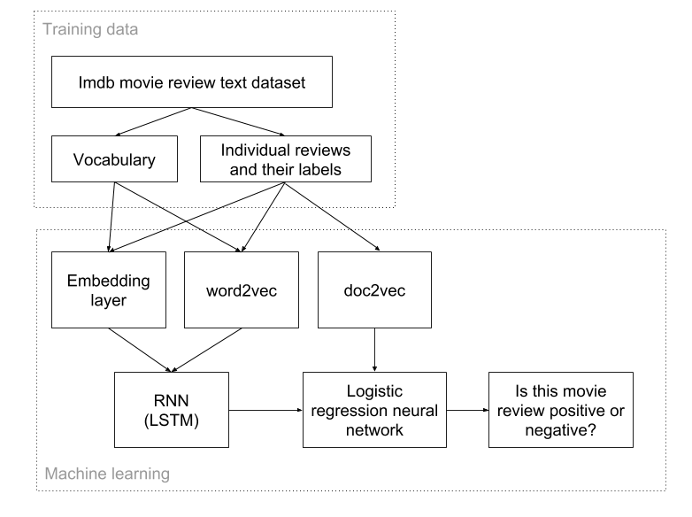

# Predict the sentiment for a given document (e.g. movie review)

Use deep learning to accomplish the sentimental prediction task. Specifically, the neural network contains a layer of recurrent neural network and a layer of logistic classifier. The reccurent neural network is used to learn a embedding vector for a given word. Such combination can incorporate sentimental meanings to the word embedding vectors.

### Three methods

#### The first method: use RNN to predict the sentimental polarity of a given document  

Implemented in lstm_parse_add_gru-vanilla.ipynb

#### The second method: combine RNN method with word2vec

Implemented in lstm_parse_add_gru-vanilla_Wemb_gensim_tidy.ipynb

#### The third method: combine doc2vec with standard logistic regression classifier

Implemented in Doc2Vec_NN.ipynb

### Libraries used

1. NLTK

2. gensim

3. theano

4. numpy

### Dataset
The IMDB dataset. Can be downloaded from [here](http://ai.stanford.edu/~amaas/data/sentiment/.)

### Descriptions of files

## Folder: notebooks
This folder contains all the jupyter notebook files. The code should be run through them and not from individual python scripts.
<table>

<tr>
<td>Doc2Vec_NN.ipynb</td>
<td>Implementation of method 3 which combine doc2vec with standard logistic regression classifier</td>
</tr>

<tr>
<td>Doc2Vec_tutorial.ipynb</td> 
<td>Exploring Gensim Doc2Vec Tutorial on the IMDB Sentiment</td> 
</tr>

<tr>
<td>Statistic_data.ipynb</td> 
<td>Get the statistics about the length of sentences in the dataset</td> 
</tr>

<tr>
<td>Wemb_gensim.ipynb</td> 
<td>Proprocess raw texts to digital indices and train them to word embeddings via gensim's word2vec</td> 
</tr>

<tr>
<td>lstm_parse_add_gru-vanilla.ipynb</td> 
<td>Implementation of the first method which uses RNN to predict the sentimental polarity of a given document</td> 
</tr>

<tr>
<td>lstm_parse_add_gru-vanilla_Wemb_gensim_tidy.ipynb</td> 
<td>Implementation of the second method which combines RNN method with gensim's word2vec</td> 
</tr>

<tr>
<td>aclImdb_2idx.ipynb</td> 
<td>Create a dictionary from the textual aclImdb dataset and convert the textual dataset to numerical dataset containing the ids of the words in the textual dataset.</td> 
</tr>

</table>
**word2vec_vs_gensim.ipynb**: Exploring two word2vec models (word2vec vs gensim)

### Some experimental statistics

